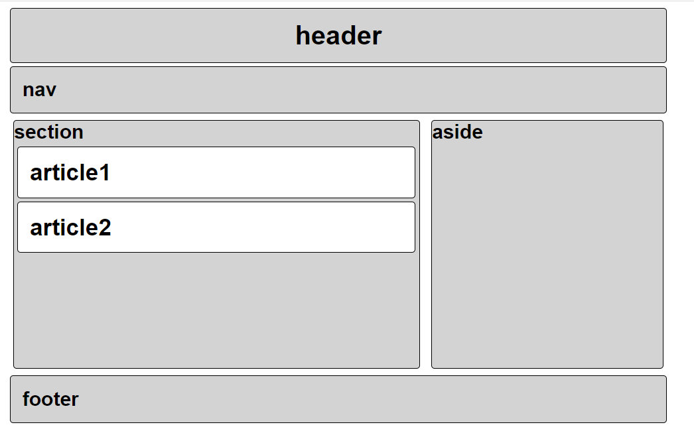

## 결과물



> 아쉬운 부분 

- section 과 aside부분의 끝이 다른 시멘틱태그들보다 안쪽으로 들어와있다. 


> 시도한 부분

try 1. 우선, section 안에 article을 넣으려고 태그 위치를 변경하였다. 

```html
<section>
      <h2 class="section">section
        <article>
          <h3 class="article">article1</h3>
        </article>
        <article>
          <h3 class="article">article2</h3>
        </article>
      </h2>
    </section>
```


try 2. 가이드에 따라 하나씩 작성하였고, 추가적으로 padding부분이 아쉬워서 4px이 아닌 14px로 늘렸다.

```html
padding: 14px;
```


try3. section과 aside부분만 동떨어진 느낌이 나서 따로 margin을 추가적으로 주었다. 

```html
margin: 4px;
```


그 외에는 Guide대로 따라서 진행하였다!!